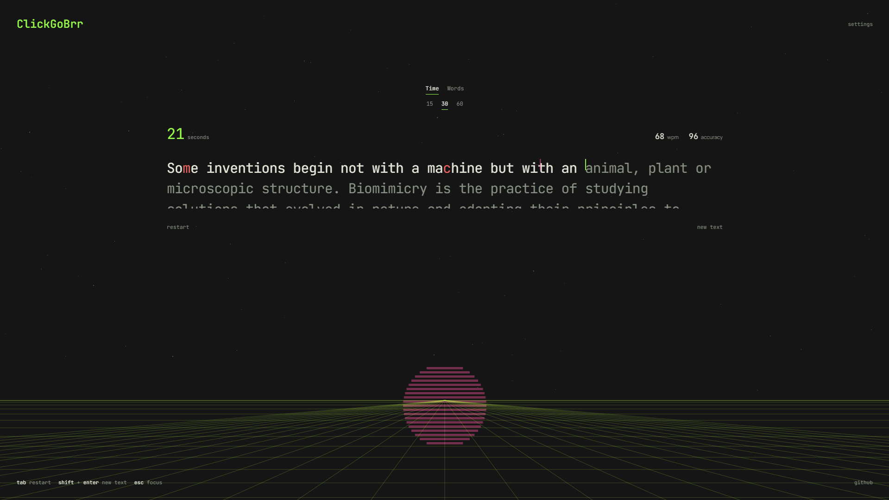
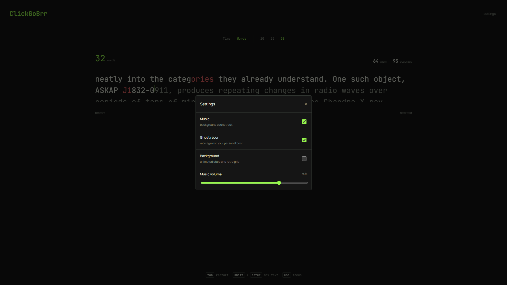

# ClickGoBrr

ClickGoBrr is a typing test designed with a retrowave aesthetic.

---

### Motivation

I found many online typing tests to be filled with ads, and their servers were occasionally down. I also wanted complete customisability, especially for things like the background and overall design, so I decided to build my own typing test with the style and features I prefer.

---

### Live Demo

The project can be viewed through the link:

https://clickgobrr.vercel.app/ 

---

### Screenshots





---

### Features

- Time Mode and Words Mode
- Live WPM and Accuracy
- Personal best records
- Ghost race against best run
- Multiple passages to test
- Keyboard shortcuts
- Focus mode
- Live Background toggle
- Background music

---

### Tech Stack

HTML, CSS, JavaScript (Vanilla)

### How It Works

Each character entered is compared with the current passage, and WPM + Accuracy are calculated while the test is running. Time Mode ends after the selected duration, whereas Words Mode ends once the selected number of words has been completed.

Personal best records are stored locally, and the ghost race saves the progress of your best run and replays it during future tests.

---

### Project Structure

```text
clickgobrr
├── index.html          # Main Page
├── assets/             # Screenshots and other assets
├── css/
│   └── style.css       # Styling
└── js/
    ├── app.js          # Typing logic
    ├── background.js   # Background canvas
    ├── extra.js        # Ghost race, Background music and more
    └── main.js         # Main script
```

---

### AI Usage

AI (ChatGPT) was used to review and improve javaScript code. Along with it AI was used to cleanup html code and create the animation for background canvas.
Almost all the coding and final implementations were done by me.

---